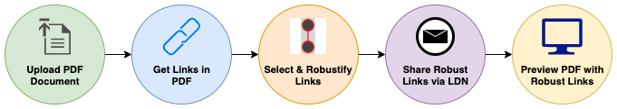

PDF Links Service
=================

The `PDF Links Service </>`_ allows you to extract links from PDF documents, "robustify" them, and notify the
availability of robust links via Linked Data (LD) Notifications.

What does it mean to "robustify" links?
---------------------------------------

Links to the web break all the time.
Broken links appear in two forms:
1) Link Rot (where following the link yields a HTTP 404 error or equivalent) and
2) Content Drift (where the content following the link are changed over time, possibly to a point where it loses all
similarity with the originally linked content)

.. toctree::
   :maxdepth: 1

   usage
   howitworks
   setup
   api/index