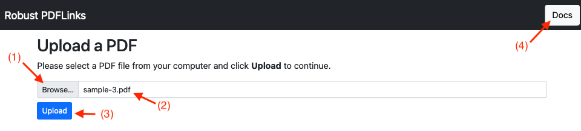

PDFLinks Service
=================

Description
-----------

The PDF Links Service allows you to extract URIs in a PDF, robustify them, and notify this robustification through a Linked Data Notification.

The process begins with uploading a PDF document.

Once the PDF is uploaded, the browser is redirected to the next page.

PDFLinks API
-----------------

.. toctree::
   :maxdepth: 2

   extractor
   util
   errors
   api

Indices and tables
------------------

* :ref:`genindex`
* :ref:`modindex`
* :ref:`search`
